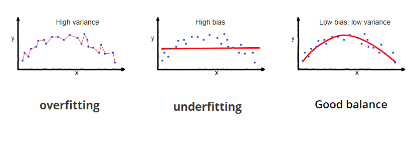

# Learning Objectives

Welcome to R Machine Learning with `tidymodels`. Our goals for this workshop are:

1.  Discuss what machine learning is, and which problems it is most (and least) equipped to address.

2.  Learn about the `tidymodels` framework to implement supervised machine learning models in R, covering pre-processing, regularization, and cross-validation.

3.  Apply the `tidymodels` framework to explore multiple machine learning algorithms in R.

Throughout this workshop series, we will use the following icons:

🔔 **Question**: A quick question to help you understand what's going on.

🥊 **Challenge**: Interactive exercise. We'll go through these in the workshop!

⚠️ **Warning**: Heads-up about tricky stuff or common mistakes.

💡 **Tip**: How to do something a bit more efficiently or effectively.

📝 **Poll**: A zoom poll to help you learn.

🎬 **Demo**: Showing off something more advanced so you know what you can use R for in the future

# Install Packages

Be sure to have the following packages installed for this workshop:

```{r install, include=FALSE}
# Run this command separately if using DataHub
# install.packages("stringi",configure.args='--disable-pkg-config')

# install.packages(c("tidyverse","tidymodels"))
library(tidymodels)
library(tidyverse)

# Prefer tidymodels functions in any case of name conflict
tidymodels::tidymodels_prefer() 
```

# What is Machine Learning?

Machine learning refers to the automated detection of meaningful patterns in data (Shalev-Schwartz and Ben-David, 2014). For this reason, some authors often use the term "statistical learning" to reference the same concept (James *et al.,* 2021). The overall goal of machine learning is to develop models that are both dynamic and data-dependent.

## What distinguishes machine learning methods from traditional statistics?

Machine learning and traditional statistics differ in their primary objectives and methodologies. Machine learning focuses on developing predictive models and often uses complex algorithms to find patterns in data, while traditional statistics aims to draw inferences about populations and relationships between variables using hypothesis testing and parametric models. Machine learning often works with large data sets, while traditional statistics may work with smaller, carefully designed samples.

Machine learning places a strong emphasis on predictive accuracy, while traditional statistics emphasizes hypothesis testing and parameter estimation within a framework of statistical significance.

📝 **Poll 1:** Which of these research applications are well suited for machine learning methods? Select all that apply.

1.  Diagnosing a patient's illness based on a cluster of symptoms and other health data.

2.  Explaining why some states have higher voter participation rates than others.

3.  Estimating the impact of unionization on worker pay.

4.  Identifying businesses to audit for tax evasion.

5.  Predicting commuting times for workers in urban areas.

**Solutions**: 1, 4, 5

# Example of a Machine Learning Problem

The core goal of machine learning is to develop models that can generalize patterns from data that can perform tasks or make predictions on new, unseen data. We will often have some output variable (denoted $y$) that we want to predict based on a set of input variables (denoted $\mathbf{X}$).

Mathematically, we suppose that there is a relationship between the output variable and the features, which we can write in a general model form as:

$Y = f(\textbf{X})+ \epsilon$

where $f$ is a fixed but unknown function of our feature vector $\textbf{X} = (X_1, X_2,...,X_n)$ and $\epsilon$ is a random error term that is independent of the $\mathbf{X}$ vector. In general, the function that connects the target variable and the features is unknown, so the algorithms we use are ways to *estimate* the relationship.

🔔 **Question 1**: Notice that we have called *y* the "outcome" or "target" variable, and the set of $\mathbf{X}$ variables "features" or "inputs." How does this language reflect a conceptual shift from traditional statistics?

**Solution**: We are focused on predicting the value of y, and are moving away from traditional statistics by not making assumptions about the nature of the causal relationship between our x and our y.

**Example 1: Employment Survey Data**

To ground symbols in code, let's explore our primary data set for the workshop: the Current Population Survey (CPS).

First, we'll load the data:

```{r}
jobs <- read.csv("../data/jobs.csv",row.names = NULL)

# look at first few rows of data frame 
head(jobs)

```

## 🥊 Challenge 1: Predicting Wage from Age

We can plot variables to see the relationship with `ggplot2` and add a best fit line. Let's first examine the relationship between a worker's age (`age`) and their hourly wage (`hourly_wage`).

```{r}
jobs %>%
  ggplot(aes(x = age, y = hourly_wage)) +
  geom_point() +
  geom_smooth(method = "lm", se = F) 
```

While it may not seem obvious, we have just implemented our first machine learning algorithm! Specifically, we have tried to predict the relationship between a single feature (`age`) and a target variable (`hourly_wage`) using linear regression. Notice that the focus is on predicting wages, rather than the value of the age parameter.

Here, the learning function $f$ can be written as:

$\texttt{hourly_wage} = f(\texttt{age}) + \epsilon$

## The bias-variance trade-off

Before we develop a better model to predict an individual's wage, let's discuss a fundamental concept in machine learning: the bias-variance trade-off. The bias-variance trade-off refers to the tension associated with model simplicity and flexibility, and describes the relationship between the two types of errors a model can make: bias and variance.

-   Bias: the difference between a model's prediction and the actual value of an observation
-   Variance: the complexity of the model



In the above example, we attempted to strike this balance by using linear regression to predict an individual's wage based on their age alone. We could have used $y = f(x)$, but this would have overfit our model by introducing high variance, and thus performed poorly on new, unseen data. Alternatively, we could have used $y = \bar{x}$, but this would have underfit our model due to its high bias.

It is essential to understand this trade-off because it helps in building models that generalize well and make accurate predictions.

# Refining Our Research Question

With these concepts in mind, let's start building a more complex model that utilizes the other features we have available that are likely related to one's wage, including education level, race, sex, and occupation.

## 🥊 Challenge 2: Exploratory Analyses

In Challenge 1, we looked at the relationship between a continuous x feature, `age`, and our target, `hourly_wage`. Now, perform your own exploratory analyses, but this time examine at least one categorical feature (or features) that you think might be useful in predicting `hourly_wage`. In the companion resource guide, we provide a comprehensive data dictionary.

```{r}
# Histogram of Wage by Sex
jobs %>%
  ggplot(aes(x = hourly_wage, fill = sex)) +
  geom_histogram(position = "identity", alpha = 0.5, bins = 30) +
  labs(title = "Overlapping Histogram of Hourly Wage by Sex",
       x = "Wage",
       y = "Frequency",
       fill = "Sex") +
  theme_minimal()

```

```{r}
boxplot(hourly_wage ~ citizen_status, data = jobs, main = "Boxplot of hourly wage by citizenship status")
```

# The Machine Learning Pipeline

Now that we have a better sense of our data's structure, let's start building out our machine learning algorithm to predict an individual's hourly wage!

We will follow these steps:

1.  Split data into training and test sets.

2. Pre-process our data so it is in the appropriate format. 

3.  Use hyperparameter tuning on our training data to select the best configuration for our model. 

4.  Train the machine learning algorithm.

5.  Evaluate the performance of the final model on the test set.

6.  Refine the models.

7.  Operationalize algorithm on new data.


##### KQ: we need to create dummy variables, but also want to impute. we should create dummies first so variables will be the same on both training and split. but we want to impute based on info only in the training set if that's going to be part of the model 

# Step 1: Train-Test Split 

The train-test split is a foundational concept in machine learning. It refers to the division of a data set into two subsets: one for training the model and another for evaluating its performance. The training set is used to teach the model, while the test set serves as an independent data set to assess how well the model generalizes to new, unseen data. Once we have partitioned our data into the training and test sets, we will not touch the test set until we are ready to evaluate our model. 

🔔 **Question 2**: How does splitting our data into the training and test sets address the bias-variance trade-off described earlier? 

**Answer**: This split is crucial for preventing overfitting, providing an unbiased evaluation of the model's performance, and ensuring that the model can make accurate predictions on data it has not encountered during training. 

## Performing the split

```{r}
# Perform train/test split
set.seed(12345) # we will set a seed for reproducibility 

jobs_split <- jobs %>% initial_split(prop = 0.80)

```

The resulting object is a `rsplit` object which contains the partitioning information for the data. To get the training and test data, we apply two additional functions. The resulting data sets have the same columns as the original data but only the appropriately sampled rows. 

```{r train_test_sets}
jobs_train <- training(penguin_split)
jobs_test <- testing(penguin_split)
print(dim(jobs_train))
print(dim(jobs_test))
```


# Step 2: Pre-Process Data with `recipes`

Sometimes, our features are not in the best format for our model to use effectively. Data is messy, and often needs to be transformed in order for a machine learning model to be able to be fit.

## 🥊 Challenge 3: Assess Data Quality 

As with traditional statistics, a 
```{r} 


```

**Feature Engineering** refers to any steps taken to reformat features to improve the modeling process. Within the `tidymodels` framework, the functions to implement feature engineering are housed in the `recipes` package.

A recipe is an object that defines the series of steps needed for any data processing for the model. A recipe is also an object that defines a series of steps for data processing. Unlike the formula method inside a modeling function, the recipe defines the steps without immediately executing them; it is only a specification of what should be done.

Let's start by taking a look at a recipe used to predict hourly wage from other features:

```{r create_recipe}
jobs_recipe <- 
  recipe(hourly_wage ~ ., data = jobs) %>%
  step_naomit(all_predictors()) %>%
  step_dummy(all_nominal_predictors())
jobs_recipe
```

This recipe provides the model that we eventually want to run and a step to convert nominal features into dummy variables. Let's break this down one component at a time:

-   The call to `recipe()` with a formula tells R the roles of the variables. Here, our dependent variable is `hourly_wage`.

-   In addition, the data argument tells `tidymodels` to only fit values in the training set.

-   What follows the `recipe` call is a series of `steps`. The first one is a step called `step_naomit()`, which omits any samples with missing data. Each step function accepts the columns that it operates on. In this case, we apply `step_naomit` to every column, using the `all_predictors()` function.

-   Next, `step_dummy()` is used to specify which variables should be converted from a qualitative format to a quantitative format, in this case, using dummy or indicator variables.

-   The function `all_nominal_predictors()` captures the names of any predictor columns that are currently factor or character.

`tidymodels` has a variety of data pre-processing step functions [available](https://recipes.tidymodels.org/reference/index.html). While we will not cover how to do so, it is also possible to write custom pre-processing functions.

### Imputation as a Pre-processing Step

Let's try another example, in which we don't *omit* samples that have missing values, but instead perform *imputation*, in which we replace those missing values according to certain criteria. There are various kinds of imputation:

-   For example, whenever we have a missing value for the `species`, we can replace that missing value with the most common species. This is called *mode imputation*.

-   Or, we could replace a missing numerical predictor (e.g., hourly wage) using the median across all the samples. This is called *median imputation*.

There are other ways to impute, but these are good starting points. The way to perform imputation in a `recipe` is via the `step_impute_*` functions. For example, let's use `step_impute_median` and `step_impute_mode`:

```{r imputation}
jobs_recipe <- 
  recipe(hourly_wage ~ ., data = jobs) %>%
  step_impute_median(all_numeric_predictors()) %>%
  step_impute_mode(all_nominal_predictors()) %>%
  step_dummy(all_nominal_predictors())
```

Above, we did the following in the recipe:

1.  Instantiated the recipe with a formula indicating that we're predicting `hourly_wage` using all available features (`~ .`). We pass in the training data at this point.
2.  Next, we impute `all_numeric_predictors()` using the median.
3.  Then, we impute `all_nominal_predictors()` using the mode.
4.  Finally, we create dummy variables for the nominal features.

This pre-processing will allow us to take advantage of samples with missing data, even if it comes at a little cost to accuracy. Imputation is often a necessary step, since it's common to have missing data.

```{r}


```

```{r}
# YOUR CODE HERE

```

## 💡 Tip: [Name of Tip]

-   Tips can be formatted as subsection (\##) when they're more substantial. Title Case applies.
-   Tips use the 💡 Electric Light Bulb Emoji in the header.
-   Tips are not numbered.
-   Keep them short and to the point.
-   See the Jupyter notebook template for an example.

🔔 **Question:**

-   Questions are used without header. -

-   uestions use the 🔔 Bell Emoji at the start of the line, followed by boldface **Question:**, followed by the question.

-   Questions are short queries about code or concepts.

-   Questions do not require participants to enter code.

-   Questions can be used as attention checks, and discussed during the workshop.

***Example:***

🔔 **Question**: what will the output of the following code be?

📝 **Poll \<Name, Number\>**

-   Polls refer to Zoom polls, which can be used as a form of formative assessment.
-   Talk to D-Lab staff if you want to create Zoom polls before adding them in the notebook.
-   Polls use the 📝 memo enoji at the start of the line, followed by boldface **Poll**, followed by the name of the poll.
-   Polls are named with the format {workshop name}{workshop part - poll number} - make sure to check if they are **activated** by clicking "Polls/Quizzes" in Zoom.
-   Polls are used without header.

### *Example:*

📝 **Poll RFun 1-1:** Why are only some of the columns visible in the output?

\## 🎬 Demo:

<Title Of Demo>

-   Demos can be used at the end of a notebook to show / highlight some advanced functionalities outside the scope of the workshop.

-   Demos are written as main sections (\#) that are linked to in the "Sections" section. Title Case applies.

-   Demos use the 🎬 Clapper Board Emoji at the start of the header.

-   Demos can used once per notebook.

-   Demos can be used to enthuse participants, and to point them to relevant other D-Lab workshops.

-   Demos are meant to be short: 5-10 mins max.

### *Example:*

## 🎬 Demo: Next Time...

Most of the time, you won't be working with single value variables or vectors. Instead, you'll be working with data that contains multiple variables. In Part 2, we will learn how to read in data to R and create **data frames** (a way to store data with multiple rows and columns).

🔔 **Tip:** Run the two chunks of code below. What do you think we are doing?

```{r}
# read in data
gap <- read.csv(file = "../data/gapminder.csv")
head(gap)

```

```{r}
# subset data
gap[gap$country == "Mexico", c("country", "year", "pop")] 


```

## Key Points

\<Summary of what was learned in today's workshop.\>

-   \<key point 1\>

-   \<key point 2\>

-   \<key point 3\>

-   max 5
