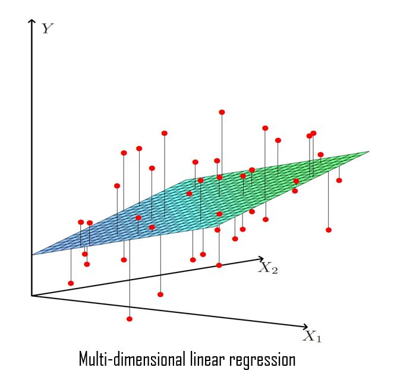
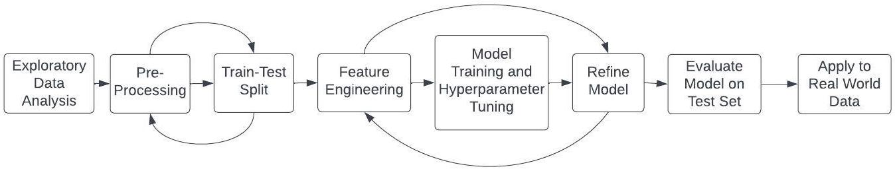

# Learning Objectives

Welcome to R Machine Learning with `tidymodels`. Our goals for this workshop are:

1.  Discuss what machine learning is, and which problems it is most (and least) equipped to address.

2.  Learn about the `tidymodels` framework to implement supervised machine learning models in R, covering pre-processing, regularization, and cross-validation.

3.  Apply the `tidymodels` framework to explore multiple machine learning algorithms in R.

*Note*: Addressing machine learning problems requires a deep conceptual understanding of the material. While we will spend time coding in R, we will also dedicate a significant portion of the workshop to motivating machine learning techniques.

# Some workshop notation

Throughout this workshop series, we will use the following icons:

🔔 **Question**: A quick question to help you understand what's going on.

🥊 **Challenge**: Interactive exercise. We'll go through these in the workshop!

⚠️ **Warning**: Heads-up about tricky stuff or common mistakes.

💡 **Tip**: How to do something a bit more efficiently or effectively.

📝 **Poll**: A zoom poll to help you learn.

🎬 **Demo**: Showing off something more advanced so you know what you can use R for in the future

# Install Packages

Be sure to have the following packages installed for this workshop:

```{r install, include=FALSE}
# install.packages(c("tidyverse","tidymodels"))
library(tidymodels)
library(tidyverse)

# Prefer tidymodels functions in any case of name conflict
tidymodels::tidymodels_prefer() 
```

*Note*: You may receive the message "Error: package or namespace load failed for ‘tidymodels’ ... there is no package called ..." when installing `tidymodels`. If you receive this message, install the packages that are giving you the errors with `install.packages()`. 

# What is Machine Learning?

Machine learning refers to the automated detection of meaningful patterns in data (Shalev-Schwartz and Ben-David, 2014). For this reason, some authors often use the term "statistical learning" to reference the same concept (James et al., 2021). The overall goal of machine learning is to develop models that are both dynamic and data-dependent.

## What distinguishes machine learning methods from traditional statistics?

Machine learning and traditional statistics differ in their primary objectives and methodologies. Machine learning focuses on developing predictive models and often uses complex algorithms to find patterns in data, while traditional statistics aims to draw inferences about populations and relationships between variables using hypothesis testing and parametric models. Machine learning often works with large data sets, while traditional statistics may work with smaller, carefully selected samples.

Machine learning places a strong emphasis on predictive accuracy, while traditional statistics emphasizes hypothesis testing and parameter estimation within a framework of statistical significance.

## 📝 Poll 1: Machine Learning Questions

Which of these research applications are well suited for machine learning methods? Select all that apply.

1.  Diagnosing a patient's illness based on a cluster of symptoms and other health data.

2.  Explaining why some states have higher voter participation rates than others.

3.  Identifying likely voters in an upcoming election.

4.  Estimating the impact of unionization on worker pay.

5.  Predicting an individual's hourly wage based on demographic, economic, and geographic information.

**Solutions**:

# Example of a Machine Learning Problem

The core goal of machine learning is to develop models that can generalize patterns from data that can perform tasks or make predictions on new, unseen data. We will often have some output variable (denoted $y$) that we want to predict based on a set of input variables (denoted $\mathbf{X}$).

Linear regression is a widely used statistical method that models the relationship between a continuous output variable and one or more input variables by fitting a linear equation to observed data. In the univariate case (i.e., y and a single x), linear regression looks like this:


Mathematically, we suppose that there is a relationship between the output variable and the features, which we can write in a general model form as:

$Y = f(\textbf{X})+ \epsilon$

where $f$ is a fixed but unknown function of our feature vector $\textbf{X} = (X_1, X_2,...,X_n)$ and $\epsilon$ is a random error term that is independent of the $\mathbf{X}$ vector. In general, the function that connects the target variable and the features is unknown, so the algorithms we use are ways to *estimate* the relationship.

**Example 1: Employment Survey Data**

To ground symbols in code, let's explore our primary data set for Part 1 of the workshop: the Current Population Survey (CPS) from 2022. You can find more information about the data set and methodology [here](https://www.census.gov/programs-surveys/cps.html).

First, we'll load the data:

```{r}
jobs <- read.csv("../data/jobs.csv",row.names = NULL)

# visually inspect the data frame 
view(jobs)
```

## 🥊 Challenge 1: Predicting Wage from Age

Let's try to predict an individual's hourly wage based on their age alone using linear regression. We can plot variables to see the relationship with `ggplot2` and add a best fit line. Let's first examine the relationship between a worker's age (`age`) and their hourly wage (`hourly_wage`).

```{r}
jobs %>%
  ggplot(aes(x = ____, y = ____)) +
  geom_point(color = "blue") +
  geom_smooth(method = "lm", color = "red", se = F) + 
  labs(title = "Scatter Plot of Age vs. Hourly Wage with Best Fit Line", 
       x = "____", 
       y = "____") + 
  theme_minimal() 
```

While it may not seem obvious, we have just implemented our first machine learning algorithm! Specifically, we have tried to predict the relationship between a single feature (`age`) and a target variable (`hourly_wage`) using ordinary least squares, a type of linear regression. Notice that the focus is on predicting wages, rather than the estimating the value of the age parameter.

Here, the learning function $f$ can be written as:

$\texttt{hourly_wage} = f(\texttt{age}) + \epsilon$

, where our y is `hourly_wage` and our x is `age`.

## 🔔 Question 1: Terminology

Notice that we have called *y* the "outcome" or "target" variable, and the set of $\mathbf{X}$ variables "features" or "inputs." How does this language reflect a conceptual shift from traditional statistics and causal inference, where we typically use language like "independent" and "dependent" variables?

**Solution**:

# Refining Our Research Question

Now, let's start building a more complex model that utilizes the other features we have available that are likely related to one's wage, including education level, race, sex, and occupation.

Importantly, we rarely predict with only a single feature! In the multivariate case, we have many axes corresponding to X variables, but still one Y variable axis. The "line" in this case turns into a hyperplane which tries to capture as much of the information about the multi-dimensional data points as possible:



## 🥊 Challenge 2: Exploratory Analyses

In Challenge 1, we looked at the relationship between a continuous x feature, `age`, and our target, `hourly_wage`. Perform your own exploratory analyses, but this time examine at least one categorical feature (or features) that you think might be useful in predicting `hourly_wage`. Which features seem most interesting to you? *Hint:* one way to explore continuous variables is by looking at overlapping histograms. Check out the documentation [here](https://ggplot2.tidyverse.org/reference/geom_histogram.html).

```{r}
# Histogram of Wage by and some categorical variable of your choice 
jobs %>%
  ggplot(aes(x = ____, fill = ____)) +
  geom_histogram(position = "identity", alpha = 0.5, bins = 30) +
  labs(title = "Overlapping Histogram of Hourly Wage by ____",
       x = "____",
       y = "Frequency",
       fill = "____") +
  theme_minimal()
```

# The Machine Learning Pipeline

Now that we have a better sense of our data's structure, let's start building out our machine learning algorithm to predict an individual's hourly wage!

To do so, we will draw primarily on `tidymodels`, an ecosystem of R packages designed to provide a consistent and tidy interface for modeling and machine learning tasks. It is built on top of the principles of the `tidyverse` and shares a consistent design philosophy, making it easy to integrate with other `tidyverse` packages like `dplyr` and `ggplot2`.



We will follow these steps:

1.  Pre-process our data so it is in the appropriate format.

2.  Split data into training and test sets.

3.  Use hyperparameter tuning on our training data to select the best configuration for our model.

4.  Train the machine learning algorithm.

5.  Evaluate the performance of the final model on the test set.

6.  Refine the models.

7.  Operationalize algorithm on new data.

# Step 1: Pre-Processing

Sometimes, our features are not in the best format for our model to use effectively. Data are messy, and often need to be transformed to be able to fit a machine learning model

## Data Types

Let's take a look at a few variables in our data set `jobs`.

```{r}
set.seed(1) # ensure we all see the same sample 

jobs %>% 
  select(hours_weekly, union, state) %>% 
  slice_sample(n=10)
```

## 🔔 Question 2: Data Types

What are the data types for these three variables? If you are familiar with linear regression, can you think of issues that might arise if we were to plug these variables into a regression model?

**Solution:**

#### Missing Values

We can see that `hours_weekly` has missing values, which is a common problem in real world data. Depending on the use, in your own work you may choose to drop data with missing values, or impute missing values based on certain criteria. In this example, we will drop rows with missing values, but in a later example, we will add imputation to our pre-processing.

## 🥊 Challenge 3: Assess Data Quality

Determine the extent to which missing values are a problem in this data set. *Hint*: try using the `colSums()` function. The documentation is available [here](https://www.rdocumentation.org/packages/base/versions/3.6.2/topics/colSums).

```{r}
colSums((is.na(____)))
```

Now that we have a better sense of our data and the types of variables we have, let's proceed.

## Recipes

The process of preparing our features (i.e., variables) to improve the modeling process is called **feature engineering**. Within the `tidymodels` framework, the functions to implement feature engineering are housed in the `recipes` package (note: this package is embedded in `tidymodels` so we do not need to load the package).

A recipe is an object that defines the series of steps needed for any data processing for the model. Unlike the formula method inside a modeling function, the recipe defines the steps without immediately executing them; it is only a specification of what should be done.

Let's start by creating a recipe for predicting an individual's hourly wage on a set of features:

```{r}
jobs_recipe <- 
  recipe(hourly_wage ~ ., data = jobs) %>%
  step_naomit(all_predictors()) %>%
  step_dummy(all_nominal_predictors()) %>% 
  step_normalize("hours_weekly")
jobs_recipe
```

This recipe provides the model that we eventually want to run and a step to convert nominal features into dummy variables. This process is often called "one-hot encoding." Let's break this down one component at a time:

-   The call to `recipe()` with a formula tells R the roles of the variables. Here, our outcome variable is `hourly_wage`.

-   What follows the `recipe` call is a series of `steps`. The first one is a step called `step_naomit()`, which omits any samples with missing data. Each step function accepts the columns that it operates on. In this case, we apply `step_naomit` to every column, using the `all_predictors()` function. We will drop rows that contain missing values in this example, but a later example will impute missing values to avoid losing data.

-   Next, `step_dummy()` is used to specify which variables should be converted from a qualitative format to a quantitative format, in this case, using dummy or indicator variables.

-   The function `all_nominal_predictors()` captures the names of any predictor columns that are currently factor or character.

-   The function `step_normalize()` normalizes/standardizes the variables so that they have a mean of zero and a standard deviation of one. This is often done for continuous variables before fitting a machine learning model so they are on the same scale. However, it makes interpreting the coefficients more difficult.

`tidymodels` has a variety of data pre-processing step functions [available](https://recipes.tidymodels.org/reference/index.html). While we will not cover how to do so, it is also possible to write custom pre-processing functions.

# Step 2: Train-Test Split

## The bias-variance trade-off

Before we proceed, let's discuss a fundamental concept in machine learning: the bias-variance trade-off. The bias-variance trade-off refers to the tension associated with model simplicity and flexibility, and describes the relationship between the two types of errors a model can make: bias and variance.

-   Bias: the difference between a model's prediction and the actual value of an observation
-   Variance: the complexity of the model


In the initial example, we attempted to strike this balance by using linear regression to predict an individual's wage based on their age alone. We could have used $y = f(x)$, but this would have overfit our model by introducing high variance, and thus performed poorly on new, unseen data. Alternatively, we could have used $y = \bar{x}$, but this would have underfit our model due to its high bias.

It is essential to understand this trade-off because it helps in building models that generalize well and make accurate predictions.

## The train-test split

Performing a train-test split is an approach to managing the bias-variance trade-off. It refers to the division of a data set into two subsets: one for training the model and another for evaluating its performance. The training set is used to teach the model, while the test set serves as an independent data set to assess how well the model generalizes to new, unseen data. Once we have partitioned our data into the training and test sets, we will not touch the test set until we are ready to evaluate our model.

🔔 **Question 2**: How does splitting our data into the training and test sets address the bias-variance trade-off described above?

**Answer**:

## Performing the split

```{r}
# Perform train/test split
jobs_split <- jobs %>% initial_split(prop = 0.80)
```

The resulting object is a `rsplit` object which contains the partitioning information for the data. To get the training and test data, we apply two additional functions. The resulting data sets have the same columns as the original data but only the appropriately sampled rows.

```{r}
jobs_train <- training(jobs_split)
jobs_test <- testing(jobs_split)
print(dim(jobs_train))
print(dim(jobs_test))
```

# Step 3: Training the Model

Within the `tidymodels` package, the `parsnip` package provides a fluent and standardized interface for various models (Kuhn and Silge, 2021). This modeling approach follows the design paradigm of the package.

We're going to use the `linear_reg` function from `parsnip` to create a linear regression model. Check out the documentation here: [here](https://parsnip.tidymodels.org/reference/linear_reg.html).

You'll notice that `linear_reg` has several input arguments we can specify, including `engine` and `mode`. These two arguments respectively indicate what software package will be used for learning the parameters, and what type of problem we're solving (in this case, a regression).

For now, we should be fine using the default arguments. So, we start by creating a model.

```{r}
model <- linear_reg() 
model
```

Now that we've initialized a basic linear model, let's apply our pre-processing recipe (i.e., set of instructions) to our data. We can do this smoothly using a `workflow()`.

```{r}
jobs_wflow <- workflow() %>% 
  add_recipe(jobs_recipe) %>%
  add_model(model)

# fit model and obtain predictions  
jobs_fit <- fit(jobs_wflow, jobs_train)
jobs_fit %>% tidy()
```

# Step 4: Evaluating the Model

Now that we have a (very) basic model, we need to determine how well it works to solve the problem of estimating the relationship. We prefer to have a quantitative approach to estimate effectiveness to compare different models or tweak our model to improve performance. In `tidymodels` this approach is empirically data-driven. This means that we use the test data to measure the model's effectiveness.

It is important to note that we keep the training and test data set apart. We can run any tweaks that we want to our training set, but we should leave the test set alone until we are ready to evaluate our models. Methods for evaluation within the `tidymodels` universe are from the `yardstick` package.

The general syntax for a metrics function in `tidymodels` is as follows:

```{r, eval = FALSE}
#function(data, truth, ...)
```

where the data argument is a data frame or tibble, and the truth argument is the column with observed outcome values. Additional arguments (...) can be used to specify columns containing features.

Now, we can perform the evaluation. The full suite of metrics functions is available [here](https://yardstick.tidymodels.org/reference/index.html). Since our running example is a linear regression, let's start with $R^2$, since that's among the easiest metrics to interpret:

```{r}
# Predict new observations of our model fit with augment() 
results <- augment(jobs_fit, jobs_test)
# Obtain R-squared
rsq_trad(results, truth = hourly_wage, estimate = .pred) 
```

💡 **Tip**: In this example, we have used ordinary least squares for our regression model. Ridge and lasso regression are two other techniques that can be useful to reduce or remove the coefficients on variables that do not add much to our example.

```{r}
# We can plot the data prior to computing metrics for a visual inspection of fit
results %>%
  ggplot(aes(x = hourly_wage, y = .pred)) +
  geom_abline(lty = 2, color="red") +
  geom_point(alpha = 0.7, color="blue") +
  labs(title = "Predicted versus actual values of wage", 
       x = "Hourly Wage", 
       y = "Predicted Values") +
  coord_obs_pred()
```

Inspecting this plot by eye, it looks like the model is struggling to predict wages for higher earners.

We can do multiple metrics at once, though. Let's pick three common metrics for linear regression models - $R^2$, Root Mean Square Error (RMSE), and Mean Absolute Error (MAE) - and evaluate them at the same time using the `yardstick` package.

```{r evaluate_metrics}
# Make a set of metrics
jobs_metrics <- metric_set(rmse, rsq, mae)
jobs_metrics(results, truth = hourly_wage, estimate = .pred)
```

## 🥊 Challenge 4: Predicting Income

Train a model to predict an individual's income `total_income` on `jobs_train` and evaluate the model on `jobs_test`. Note that this is related to, but not a direct function of, one's wage because income can come from multiple sources (e.g., retirement savings, investment income).

First, create a recipe that gives a set of instructions for pre-processing.

```{r}
chal4_recipe <- 
  recipe(____ ~ ., data = ____) %>% # tell r what our outcome variable is 
  step_naomit(all_predictors()) %>% # drop records with missing values 
  step_dummy(all_nominal_predictors()) # create dummy variables from categorical variables
chal4_recipe
```

Next, create a workflow that applies our recipe (i.e., set of pre-processing instructions) and adds our linear model `model` that we initialized above.

```{r}
chal4_wflow <- workflow() %>% 
  add_recipe(____) %>% 
  add_model(____)
```

Our workflow now contains all of the steps and instructions to train the model. `add_recipe` has laid out the pre-processing instructions, and `add_model` has specified that we will use our linear regression model `model` to fit to the training data.

```{r}
# obtain predictions 
chal4_fit <- fit(____, ____)
chal4_fit %>% tidy()
```

Deploy our fitted model `chal4_fit` on the test set `jobs_test` to see how well it did at predicting an individual's income.

```{r}
# Predict new observations of our model fit with augment() 
chal4_results <- augment(____, ____)

# Obtain R-squared
chal4_metrics <- metric_set(rmse, rsq, mae)
chal4_metrics(chal4_results, truth = ____, estimate = ____)
```

# Recap

Congratulations, you've trained your first machine learning model in `tidymodels`! In Part 2 of the workshop, we will further develop the workflow to other machine learning problems.
