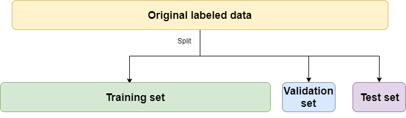

# Recap of Part 1

In Part 1 of this workshop, we attempted to predict the value of a
single, continuous outcome variable `hourly_wage` based on a range of
input features, including age, location, and industry. Specifically, we
covered:

-   Train-test splits: partitioning the data set into a training set
    used to train our model, and a test set used to evaluate the model's
    performance.

-   The bias-variance trade-off: the balance between the model's ability
    to capture the true underlying patterns of the training data (bias)
    and its flexibility to learn from specific instances within that
    data (variance). This trade-off matters because it directly affects
    the generalization ability of the model to new, unseen data.

-   Pre-processing: cleaning and transforming raw data into a suitable
    format for analysis, ensuring the data is free of errors,
    inconsistencies, and irrelevant information. It often includes
    coding categorical variables and normalizing numerical values to
    reduce bias and improve model accuracy.

Today, we will apply and expound upon these principles to develop models
to predict categorical variables. This process is called
'classification.'

# Install Packages and Load Data

Before we dive into today's material, let's load our libraries
`tidymodels` and `tidyverse` libraries.

```{r install, include=FALSE}
library(tidymodels)
library(tidyverse)

# Prefer tidymodels functions in any case of name conflict
tidymodels::tidymodels_prefer() 
```

# Other Tasks in Supervised Machine Learning: Classification

Thus far, we've spent most of our time working through regression
problems (i.e., predicting a continuous outcome variable). Let's switch
to a new task: classification. In classification, we aim to predict one
of a group of values. For example, predicting a qualitative response is
considered classification because we assign the observation to a
category (or class).

Like regression, classification is also a supervised learning technique
because we have a set of labeled training data that we can use to build
a classifier. Now, however, we have access to different techniques
because the structure of our outcome variable is categorical.

## 📝 Poll 1: Classification vs. Regression

Identify which of the following are classification problems in machine
learning.

1.  An advertiser is interested in the relationship between age and the
    number of hours of YouTube consumed.

2.  A medical testing company conducts a procedure to determine whether
    a person has a cancer diagnosis.

3.  A researcher is interested in the effect of an education
    intervention on students' test scores.

4.  A software engineer is designing an algorithm to detect whether an
    email is spam or not.

5.  A political scientist wants to classify Twitter posts as positive or
    negative.


# Today's Data: Voting Patterns in the 2020 Election

Now, let's load our primary data set for today's workshop: `vote2020`.
Our goal is going to be predicting whether someone voted in the 2020
election, perhaps to tailor engagement strategies toward those least
likely to vote in an upcoming election. These data are based on the
Current Population Survey's [Voter
Supplement](https://cps.ipums.org/cps/voter_sample_notes.shtml).

```{r}
vote2020 <- read.csv("../data/vote2020.csv",row.names = NULL)

# visually inspect the data frame 
view(vote2020)
```

# Exploratory Analysis

Recall that the first step in machine learning (and most analyses) is to
explore the data we're working with to get a sense of its shape and
anticipate problems that may arise.

## 🥊 Challenge 1: Exploratory Data Analysis

Perform exploratory analyses on the `vote2020` data set, keeping in mind
that today's goal is to predict `voted`. What do you notice about the
data?

```{r}

 ## YOUR CODE HERE 

```

# Train-Test Split

Recall from Part 1 that a critical first step in machine learning is
partitioning our data into training and test sets.

## 🔔 Question 1: Train-Test Split

A researcher used the entire `vote2020` data set to train a model that
resulted in impressively high accuracy during evaluation. However, upon
deploying this model to predict voter turnout for an upcoming election,
the predictions significantly diverged from actual turnout, with many
discrepancies in who was predicted to vote versus who actually voted.
The model's near-perfect performance in development starkly contrasted
its poor real-world prediction outcomes, indicating a potential
oversight in the model training and evaluation process. Why might that
be?

**Answer 1**: 

Now that we have a better sense of the data, let's go ahead and split
`vote2020` into training and test sets:

```{r}
# Perform splits
vote2020$voted <- as.factor(vote2020$voted)
vote_split <- initial_split(vote2020, prop = 0.75)
vote_train <- training(vote_split)
vote_test <- testing(vote_split)
```

# Pre-Processing

In our example from Part 1, we prepared our data for analysis by
recoding categorical variables and normalizing numeric ones using
`step_dummy(all_nominal_predictors())` and `step_normalize()`,
respectively.

In that example, we also dropped rows that had any missing values across
variables. Let's try another example, in which we don't *omit* samples
that have missing values, but instead perform *imputation*, in which we
replace those missing values according to certain criteria. There are
various kinds of imputation, including:

-   For example, whenever we have a missing value for the `occupation`,
    we can replace that missing value with the most common occupation.
    This is called *mode imputation*.

-   Or, we could replace a missing numerical predictor (e.g., age) using
    the median across all the samples. This is called *median
    imputation*.

There are other ways to impute, but these are good starting points. The
way to perform imputation in a `recipe` is via the `step_impute_`
functions.

## 🥊 Challenge 2: Creating a Recipe

Using the same logic from Part 1, create your own recipe called
`voterecipe` that lays out the steps for pre-processing the data.
Instead of dropping rows with missing values, use
[step_impute_median](https://recipes.tidymodels.org/reference/step_impute_median.html)
to impute numeric variables and
[step_impute_mode](https://recipes.tidymodels.org/reference/step_impute_mode.html)
to impute categorical variables.

```{r}
voterecipe <- 
  recipe(_____ ~ ., data = _____) %>%
  step_impute_median(_____) %>%
  step_impute_mode(_____) %>%
  step_dummy(_____) 
```

This pre-processing will allow us to take advantage of samples with
missing data, even if it comes at a little cost to accuracy. Imputation
is often a necessary step, since it's common to have missing data.

## 🔔 Question 2: Imputation

Notice that we have only applied our recipe to the training data so far.
Explain why it is important to perform imputation separately on the
training and test sets rather than imputing missing values before
splitting the data set. Consider why we don't want the data we train our
model on to be exposed to our test data set in the first place.

**Answer 2**: 

# Developing and Evaluating Models

Now that we've performed exploratory analyses, a train-test split, and
pre-processing, let's go ahead and train our model. We will create a
classifier (i.e., a model that predicts membership in a group) with
logistic regression.

#### Algorithm 1: Logistic Regression

Machine learning practitioners often recommend logistic regression as a
starting model when predicting a binary outcome or probability. For
example, if we are estimating the relationship between mortality and
income, we can estimate the probability of mortality given a change in
income.

We write this as $P[M|I]$ and the values will range between 0 and 1. We
can make a prediction for any given value of income on the mortality
outcome. Normally, we establish a threshold for prediction. For example,
we might predict death (M) where $P[M|i] > 0.5$.

Logistic regression is a generalized linear model where we model the
probability function using the logistic function, an s-shaped curve
sometimes called a sigmoid function. The general function is:
$p(Y= 1|X)$. In the example below, the green data points will be
classified as 0 because $p$ \< 0.5; the orange points will be classified
as 1 because $p$ \> 0.5.


Here's how to fit classification problems in `tidymodels` using logistic
regression.

In `tidymodels`, creating a logistic regression follows the exact same
procedure as a linear regression. This time, however, we will use
`logistic_reg()` to initiate the function. Let's create the model:

```{r}
# Create model
logistic_model <- logistic_reg(mode = "classification")
```

Now, let's fit the model on the training data. We first create a
workflow that lists instructions for pre-processing and the model we
want to use, and then apply it to the training data.

```{r}
vote_wflow <- workflow() %>%
  add_recipe(voterecipe) %>%
  add_model(logistic_model)

vote_fit <- fit(vote_wflow, vote_train)
vote_fit %>% tidy()
```

Finally, let's use augment from the `yardstick` package to obtain the
predictions, and take a look at them:

```{r}
logistic_predictions <- augment(vote_fit, new_data = vote_test)
logistic_predictions[,14:17] # look at last 4 columns 
```

## 🔔 Question 3: Analyzing Output

Notice that four new columns have appeared in our data set. What do
these values mean? What are they telling us?

**Answer 3**: 

To evaluate the model, we'll use the `accuracy` function:

```{r}
accuracy(logistic_predictions, truth = voted, estimate = .pred_class, type="class")
```

We predicted the likelihood that someone voted in the last election with
an accuracy of about 81% - not bad!

We can also create what's called a 'confusion matrix' to see how well
our model did at predicting each class. A confusion matrix is helpful if
you care about false positives (predicting 1 when the true value is 0)
and false negatives (predicting 0 when the true value is 1). In the
context of testing for Covid-19, we might want care more about failing
to diagnose a person with the virus (i.e., a false negative) because the
stakes are higher.

```{r}
logistic_predictions %>%
  conf_mat(truth = voted, estimate = .pred_class)
```

So far we have trained a simple logistic regression model, there are
many other options in our machine learning arsenal to get a better
prediction.

#### Hyperparameter Tuning and Regularization

Notice that until now, we have used the default settings for the linear
and logistic regressions we have run. Looking at the
(documentation)[<https://www.rdocumentation.org/packages/parsnip/versions/0.0.0.9001/topics/logistic_reg>]
for logistic regression, we see that there are many arguments that we
left blank when we initialized our model above. These arguments, also
known as 'parameters', correspond to statistical choices about how the
model should operate or be structured.

Some of these hyperparameters include 'engine' and 'penalty'.

-   Engine: Different engines can implement regression through various
    algorithms or computational approaches. When you specify an engine
    for logistic regression in R, you're choosing the particular set of
    algorithms and optimizations that will be used to train your model.

-   Penalty: "penalty" refers to a regularization technique used to
    prevent overfitting by discouraging overly complex models. It does
    this by adding a penalty to the loss function for large
    coefficients. Common penalties are L1 (Lasso), which can shrink some
    coefficients to zero (thus performing feature selection), and L2
    (Ridge), which shrinks all coefficients toward zero but typically
    doesn't set any to exactly zero. The penalty helps in creating
    simpler, more generalizable models that perform better on unseen
    data by prioritizing the most influential features and reducing the
    model's sensitivity to the training data's noise.

For example, we can add a 'penalty' on the size of the coefficients of a
model and reduce the likelihood of overfitting. Lasso, ridge, and
elastic net are different types of penalties that greatly reduce or
shrink to zero coefficients on variables that are picking up on a lot of
noise. The broad technique of reducing overfitting is called
'regularization.'

## 🥊 Challenge 3: Changing Hyperparameters

We have reproduced the original code from above that trained a basic
classifier on our voting data set without changing any of the
hyperparameters, as well as the code that obtains predictions. Re-run
this code several times, but each time change the hyperparameters in the
model specification. For penalty, include a non-negative number; and for
engine, select either "glmnet" or "glm". How does the accuracy change?

```{r}
chal3_model <- logistic_reg(mode = "classification", 
                               engine="glmnet", 
                               penalty=____)

chal3_wflow <- workflow() %>%
  add_recipe(____) %>%
  add_model(____)

chal3_fit <- fit(chal3_wflow, ____)

chal3_predictions <- augment(____, new_data = ____)

accuracy(chal3_predictions, truth = ____, estimate = .pred_class, type="class")
```

It's nice that we can do different types of regularization, but how do
we know what value of the penalty coefficient to pick? In machine
learning, this value - which we choose before fitting the model - is
known as a hyperparameter. Since hyperparameters are chosen *before* we
fit the model, we can't just choose them based off the training data.
So, how should we go about conducting **hyperparameter tuning**:
identifying the best hyperparameter(s) to use?

Let's think back to our original goal. We want a model that generalizes
to unseen data. So, ideally, the choice of the hyperparameter should be
such that the performance on unseen data is the best. We can't use the
test set for this, but what if we had another set of held-out data?

# Hyperparameter tuning

Cue hyperparameter tuning! Hyperparameter tuning is crucial in machine
learning because it directly impacts the performance and effectiveness
of models. By fine-tuning hyperparameters, practitioners can optimize
models to achieve higher accuracy, better generalize to unseen data, and
prevent issues like overfitting or underfitting. This process allows for
the customization of models to specific data sets and objectives,
enabling the discovery of the best configuration for a given problem.

## Choosing Hyperparameters: Validation Sets

This is the basis for a **validation set**. If we had extra held-out
data set, we could try a bunch of hyperparameters on the training set,
and see which one results in a model that performs the best on the
validation set. We then would choose that hyperparameter, and use it to
refit the model on both the training data and validation data. We could
then, finally, evaluate on the test set.



# Cross Validation

We just formulated the process of choosing a hyperparameter with a
single validation set. However, there are many ways to perform
validation. The most common way is **cross-validation**.
Cross-validation is motivated by the concern that we may not choose the
best hyperparameter if we're only validating on a small fraction of the
data. If the validation sample, just by chance, contains specific data
samples, we may bias our model in favor of those samples, and limit its
generalizability.

So, during cross-validation, we effectively validate on the *entire*
training set, by breaking it up into folds. Here's the process: We can
use a process called cross-validation to do select the best

1.  Perform a train-test split, as you normally would.
2.  Choose a number of folds - the most common is $K=5$ - and split up
    your training data into those equally sized "folds".
3.  For each hyperparameter you want to tune, specify the possible
    values it could take. Then, for each hyperparameter:
    1.  For *each* *value* of that hyperparameter, we're going to fit
        $K$ models. Let's assume $K=5$. The first model will be fit on
        Folds 2-5, and validated on Fold 1. The second model will be fit
        on Folds 1, 3-5, and validated on Fold 2. This process continues
        for all 5 splits.
    2.  The performance of each value of that hyperparameter is
        summarized by the average predictive performance on all 5
        held-out folds. We then choose the hyperparameter value that had
        the best average performance.
4.  We can then refit a new model to the entire training set, using our
    chosen hyperparameter(s). That's our final model - evaluate it on
    the test set!


## Hyperparameter Tuning and Cross Validation in Practice

We need to do two things:

1.  Decide to perform hyperparameter tuning on the penalty value, and
2.  Do so using cross-validation.

The `tidymodels` suite has two packages to help us with these steps:
`tune` and `rsample`.

Let's illustrate both these packages in the classification example. We
already have a recipe set up:

```{r}
voterecipe
```

When specifying the model, however, we're going to do something slightly
different:

```{r}
tuned_logistic_model <- logistic_reg(
  penalty = tune(),
  engine = "glmnet")
```

We passed in a function called `tune()`. This signals to `tidymodels`
that we'd like to tune this hyperparameter. How do we indicate what
values we should test during tuning? We're going to keep things simple
and focus on the most basic choice of tuning: a grid search. In this
case, we specify a range of values, and then test every single one for
the hyperparameter. We use the `grid_regular` function for this
procedure:

```{r}
# Create grid of parameters
cv_grid <- grid_regular(
  penalty(range = c(-5, 5)), # select penalty values with -5 and 5 
  levels=10) # pick 10 values between -5 and 5 

print(cv_grid)
```

## 🔔 Question 4: Analyzing a Grid

We have a hyperparameter grid with 10 rows. What does each of these
signify?

**Solution 4**: 

## 🎬 **Demo**: Performing Hyperparameter Tuning with Cross Validation

Next, we need to specify how we will perform cross-validation. From the
`rsample` package, we can use the function `vfold_cv` to create the
training folds. In this case, `v` is what's used for "K".

```{r}
vote_folds <- vfold_cv(vote_train, v = 5)
vote_folds
```

We have a tuned model, a grid of hyperparameters, and a set of folds. We
create our workflow as before: we input the recipe (i.e., the set of
pre-processing instructions) and the model specification. But, to train
the workflow, we use the `tune_grid` function. All the pieces we've
created are passed into this function:

```{r}
# Create workflow
vote_wflow <- workflow() %>%
  add_recipe(voterecipe) %>%
  add_model(tuned_logistic_model)

# Tune and fit models with tune_grid()
vote_cv_fit <- tune_grid(
  # The workflow
  vote_wflow, 
  # The folds we created
  resamples = vote_folds,
  # The grid of hyperparameters
  grid = cv_grid)
```

There are some nice plotting functions we can use to visualize how the
performance varies as a function of the regularization. For example,
check out the `autoplot()` function:

```{r}
autoplot(vote_cv_fit, 
         metric="accuracy") 
```

Each of the ten points on this graph corresponds to a set of
hyperparameters. We can see that the third combination yields the
highest accuracy of about 81.5%. What does this tell us about how much
regularization we should use?

Instead of picking the combination of hyperparamters that yields the
best accuracy by eye, we can automate this procedure. The `select_best`
function will do this for us:

```{r}
# Select best metric according to accuracy 
vote_cv_best <- select_best(vote_cv_fit, metric = "accuracy")
vote_cv_best
```

Cross-validation selected a penalty value of 0.0017 as the best
hyperparameter for our model. What do we do at this point?

Recall that, during cross-validation, we split up the data and examine
performance across many folds. Now that we know what is likely the best
penalty, we can re-train on the *entire* training set to produce our
final model.

We do this with the `finalize_workflow` function.

```{r}
# Get our final model and finalize workflow
cv_final <- vote_wflow %>%
  finalize_workflow(parameters = vote_cv_best) %>% # use the best parameters 
  fit(data = vote_train)
cv_final %>% tidy()
```

And lastly, we'll examine the performance on the test set:

```{r}
cv_predictions <- augment(cv_final, new_data = vote_test)

accuracy(cv_predictions, truth = voted, estimate = .pred_class, type="class")
```

## 🔔 Question 5: Accuracy on the Test Set

Notice our final accuracy on the test set is lower than our accuracy on the training set. Why might that be? 

**Solution 5**: 

## Hyperparameter Tuning vs. Default Arguments

If we compare this to the original model we fit earlier where we made a
guess at the best value for the penalty hyperparameter, it reveals that
we that we can fit better models via cross-validation than with just a
single training set. This is reflected in the higher accuracy compared
with the model where we used the default arguments of `logistic_reg()`.

# Concluding Remarks

Congratulations, you've made it! We covered the basics of supervised
machine learning in `tidymodels` in this workshop. However, there's much
more to explore. The best way to keep pushing forward is to choose a
problem to study, and refer to the documentation when you need help. The
website [Kaggle](https://www.kaggle.com/) has many good data science
problems to work on if you need help choosing a task!
